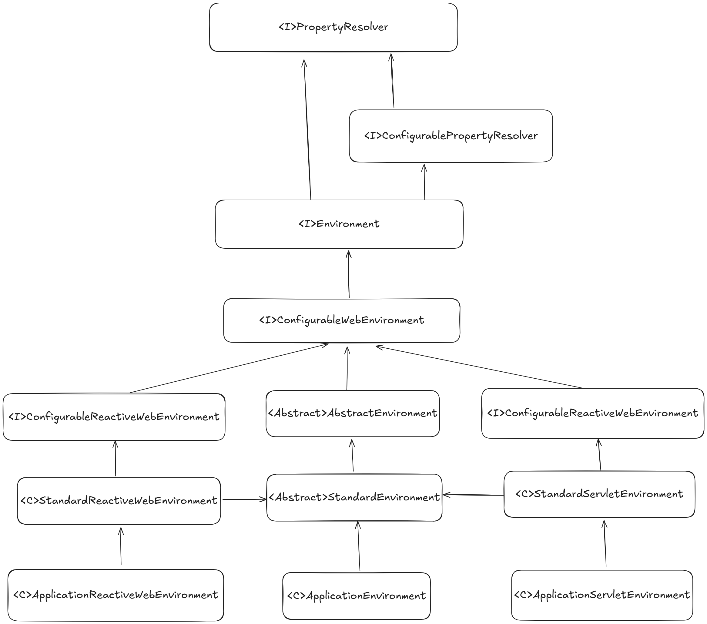

# Environment
* Environment 继承自PropertyResolver，所以它实际上就是个属性容器
* 命名为Environment，它就掌管了所有的application所有的属性，包括：
  * 属性文件、JVM 系统属性、系统环境变量、JNDI、servlet 上下文参数、临时 Properties 对象、映射等。
  * 但是他们加载的顺序不同，使用时的同名的key优先级也不同。

| 类型               | 解释                               | 加载顺序 | 使用优先级 | 扩展 |   |   |   |
|------------------|----------------------------------|------|-------|----|---|---|---|
| 属性文件             |  |      |       |    |   |   |   |
| JVM 系统属性         |  java.lang.System.getProperties()       |      |       |    |   |   |   |
| 系统环境变量           |  java.lang.System.getenv()                                |      |       |    |   |   |   |
| JNDI             |                                  |      |       |    |   |   |   |
| servlet 上下文参数    |                                  |      |       |    |   |   |   |
| 临时 Properties 对象 |                                  |      |       |    |   |   |   |
| 映射等              |                                  |      |       |    |   |   |   |
|                  |                                  |      |       |    |   |   |   |
|                  |                                  |      |       |    |   |   |   |

## ConfigurableEnvironment
* 扩展1： 重要的作用是引入了MutablePropertySources，用于管理不同类型的属性。
  * 每个类型的属性用PropertySource维护。 
  * 其实就是把Property拔高了一层，维护多个Property映射。
  * 所以在getProperty时，遍历PropertySource就决定了各类型配置的优先级了。
* 扩展2： ConfigurableEnvironment也继承了[ConfigurablePropertyResolver](#configurablepropertyresolver)接口
* 扩展3： 增加 Active Profile功能，使得不同环境的文件选择性生效
* 子类结构： 

## 子类说明：
* 

## prepareEnvironment
* 必须要在ApplicationContext#refresh 之前，才能保证类的初始化符合预期。 

~~~java
 private ConfigurableEnvironment prepareEnvironment(SpringApplicationRunListeners listeners,
                                                    DefaultBootstrapContext bootstrapContext, ApplicationArguments applicationArguments) {
    // Create and configure the environment
    ConfigurableEnvironment environment = getOrCreateEnvironment();
    configureEnvironment(environment, applicationArguments.getSourceArgs());
    ConfigurationPropertySources.attach(environment);
    listeners.environmentPrepared(bootstrapContext, environment);
    DefaultPropertiesPropertySource.moveToEnd(environment);
    Assert.state(!environment.containsProperty("spring.main.environment-prefix"),
            "Environment prefix cannot be set via properties.");
    bindToSpringApplication(environment);
    if (!this.isCustomEnvironment) {
        EnvironmentConverter environmentConverter = new EnvironmentConverter(getClassLoader());
        environment = environmentConverter.convertEnvironmentIfNecessary(environment, deduceEnvironmentClass());
    }
    ConfigurationPropertySources.attach(environment);
    return environment;
}
~~~
#### 1、create Environment
* Environment 对象是委托给ApplicationContextFactory生成的
* 而ApplicationContextFactory根据WebApplicationType不同，有不同的实现类，生成的Environment对象也就不同了
* 如果我们想扩展，可以在spring.factories中 声明自己的ApplicationContextFactory，只要优先级比默认的高就可以了
  * 或者自定义SpringApplication，然后修改它的ApplicationContextFactory为自定义的ApplicationContextFactory
###### 默认过程：
1. 构造器中默认加载了一个MutablePropertySources
2. 依次添加configurePropertySource
    * StandardServletEnvironment 加载 servletConfigInitParams 、 servletContextInitParams 、jndiProperties
        * servlet会在tomcat加载过程中初始化
    * StandardEnvironment 加载 systemProperties 、 systemEnvironment
        * 直接初始化
#### 2、configure Environment
1. set ConversionService
2. configure Property Sources
    * 追加或者新增一个PropertySources，用来存储所有的命令行属性，放到MutablePropertySources中
#### 3.configureProfiles
* 这一步不一定有，主要用于自定义SpringApplication的时候，可能自己声明了active profiles
#### 4. attach
* 没太搞懂这步在干啥，把之前的所有 PropertySource 放在一个新的PropertySource中,叫：configurationProperties
#### 5. 发布事件： environmentPrepared
* spring其他框架可以依赖事件机制添加新的PropertySources
* 比如：ConfigDataEnvironmentPostProcessor 加载了application.yml。 内部还还根据active profile 加载application-activeProfile.yml
#### 6、将evn放入到Binder中，这样后续可以使用Binder为Properties对象赋值了

#### 7、custom Environment 支持 

## 优先级

## 使用
* Binder

#### ConfigurablePropertyResolver
* 扩展1： 类型转换功能(ConfigurableConversionService)
* 扩展2： 占位符替换能力
* 扩展3： 属性验证