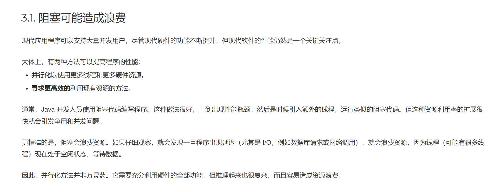

### reactor的意义

* 这里关于阻塞调优的说法，适用与所有场景。
* 线程数并非越多越好，我们可以粗暴的认为线程（或者CPU）一刻不停的运转是最好的。
* 但是有个悖论就是：服务一般必然牵涉到数据库的操作，而大部分框架采用的都是阻塞模式，尤其微服务架构下，RPC本身也会成为阻塞的地方
* 那解决办法通常分为两类： 异步非阻塞 和 超多线程 （不是只有这两种，而是这里这分析这两种）
  * 超多线程： 现代操作系统基本都是时间片模型，既然线程会阻塞，那就多开一些，虽然单个线程并没有一直运作，单CPU却没有停歇过的。
  * 异步非阻塞： 实现的方式也很多，这里重点reactor模型。 基于发布订阅模式，真正让线程永不停歇。
* 无论那种方式，都存在一个明显的问题，那就是同时处理的请求很多，我们让CPU永不停息的代价是：
  * 内存的过度消耗，请求的挤压导致请求相关的上下文都必须保留在内存中，甚至像reactor为了实现异步非阻塞，也需要更多额外的内存。